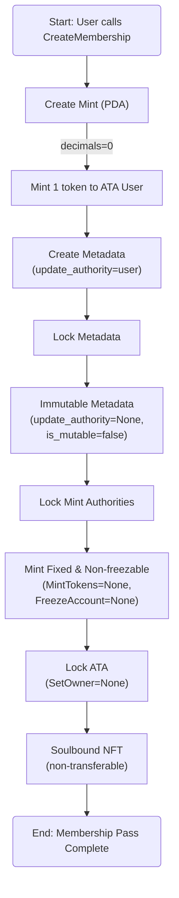

# Project Description

**Deployed Frontend URL:** [TODO: Link to your deployed frontend]

**Solana Program ID:** [TODO: Your deployed program's public key]

## Project Overview

### Description

An NFT Membership Pass application built on Solana. This application will demonstrate how an NFT can be used to manage access by utilizing pNFT (soulbound), as well as tier-based metadata and expiry dates to manage membership.

### Key Features

- **Mint NFT**: Mint a new NFT with metadata (tier & expiry).
- **Soulbound NFT**: Transfers will automatically fail due to ruleset restrictions.
- **View Metadata**: View the metadata attached to the NFT (tier & expiry).

### How to Use the dApp

1. **Connect Wallet**
2. **Mint NFT**: Mint a new NFT by adding tier metadata (Bronze / Silver / Gold) and an expiry date.
3. **Transfer NFT**: Transfers will fail due to the soulbound NFT.
4. **View NFT**: View the tier metadata and expiry date of the NFT. If the NFT has expired, the UI will indicate that the membership is no longer valid.

## Program Architecture

This NFT membership pass application has three accounts: Mint, Token, and Metadata. This program has one core instruction: create NFT to mint NFTs.



### PDA Usage

This program uses Program-Derived Addresses to create a deterministic mint account for each NFT.

PDAs Used:

- Mint PDA: Derived from seeds `["mint", user_wallet_pubkey, tier]`, this PDA ensures the uniqueness and determinism of an NFT.

### Program Instructions

Instructions Implemented:

- CreateMint: Mint a new NFT with metadata.

### Account Structure

This program uses the Mint Account from the SPL Token Program.
The Mint Account represents the token definition on the network (not the user's balance) and stores global metadata such as total supply, decimals, and authority.

Here is the structure of `Mint` (imported from `anchor_spl`):

```rust
#[repr(C)]
#[derive(Clone, Copy, Debug, Default, PartialEq)]
pub struct Mint {
  /// Optional authority used to mint new tokens. The mint authority may only
  /// be provided during mint creation. If no mint authority is present
  /// then the mint has a fixed supply and no further tokens may be
  /// minted.
  pub mint_authority: COption<Pubkey>,
  /// Total supply of tokens.
  pub supply: u64,
  /// Number of base 10 digits to the right of the decimal place.
  pub decimals: u8,
  /// Is `true` if this structure has been initialized
  pub is_initialized: bool,
  /// Optional authority to freeze token accounts.
  pub freeze_authority: COption<Pubkey>,
}

// NFT context example:
// supply = 1
// decimals = 0
// mint_authority = PDA or None (if locked)
// freeze_authority = None (optional, for immutability)
```

## Testing

### Test Coverage

[TODO: Describe your testing approach and what scenarios you covered]

**Happy Path Tests:**

- Test 1: [Description]
- Test 2: [Description]
- ...

**Unhappy Path Tests:**

- Test 1: [Description of error scenario]
- Test 2: [Description of error scenario]
- ...

### Running Tests

```bash
# Commands to run your tests
anchor test
```

### Additional Notes for Evaluators

I've created projects using vaults and escrow before, but this is my first time working with NFTs. So, this project can be an introduction to how NFTs work and can also serve as a foundation for other NFT projects.
